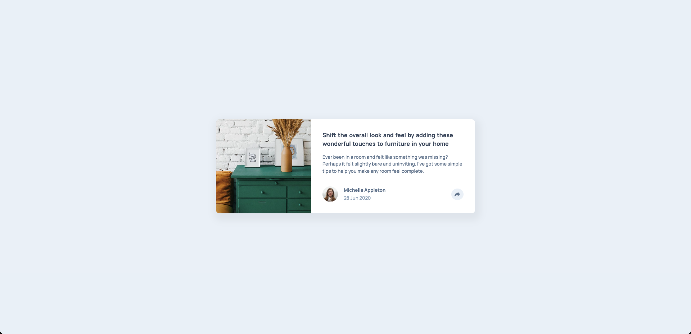

# Frontend Mentor - Article preview component solution

## Table of contents | 目錄

- [Overview | 概述](#overview--概述)
  - [The challenge | 挑戰](#the-challenge--挑戰)
  - [Screenshot | 截圖](#screenshot--截圖)
  - [Links | 連結](#links--連結)
- [My process | 開發過程](#my-process--開發過程)
  - [Built with | 使用技術](#built-with--使用技術)
  - [What I learned | 學習心得](#what-i-learned--學習心得)
  - [Continued development | 未來發展](#continued-development--未來發展)
- [Author | 作者](#author--作者)

## Overview | 概述

### The challenge | 挑戰

Users should be able to: | 用戶應該能夠：

- View the optimal layout for the component depending on their device's screen size
  根據設備螢幕大小查看最佳組件布局
- See the social media share links when they click the share icon
  點擊分享圖示時查看社交媒體分享連結

### Screenshot | 截圖



### Links | 連結

- Solution URL: [https://github.com/ylin320/Article-preview-component]
- Live Site URL: [https://ylin320.github.io/Article-preview-component/]

## My process | 開發過程

### Built with | 使用技術

- Semantic HTML5 markup
- CSS custom properties
- Flexbox
- CSS Grid
- Mobile-first workflow
- Vanilla JavaScript

### What I learned | 學習心得

During this project, I gained valuable insights into several key areas:
在這個專案中，我在以下幾個關鍵領域獲得了寶貴的見解：

1. **[JavaScript Event Handling and Toggle Functionality | JavaScript 事件處理和切換功能]**

   - Learned how to control button states and toggle effects
     學習如何控制按鈕狀態和切換效果
   - Implemented share button functionality with proper state management
     實現了具有適當狀態管理的分享按鈕功能

   ```js
   button.addEventListener("click", () => {
     button.classList.toggle("clicked");
   });
   ```

2. **[CSS Advanced Techniques | CSS 進階技巧]**

   - Mastered the use of `::after` pseudo-element to create bubble shapes
     掌握使用 `::after` 偽元素創建氣泡形狀
   - Learned how to create dynamic tooltips and popups
     學習如何創建動態提示框和彈出窗口

   ```css
   .share-container::after {
     content: "";
     border: 12px solid transparent;
     border-top-color: var(--VeryDarkGrayishBlue);
     border-bottom: 0;
     bottom: -0.7rem;
     position: absolute;
   }
   ```

3. **[Responsive Image Handling | 響應式圖片處理]**

   - Explored different approaches to image filling and scaling
     探索不同的圖片填充和縮放方法
   - Finally solved the layout using CSS Grid
     最終使用 CSS Grid 解決布局問題

   ```css
   .card {
     display: grid;
     grid-template-columns: 16.5rem 1fr;
   }
   ```

4. **[Mobile-First Development Lessons | 移動優先開發經驗]**
   - Learned the importance of proper HTML structure planning
     學習了正確規劃 HTML 結構的重要性
   - Discovered that moving the author section inside content required significant CSS adjustments
     發現將 author 部分移到 contents 內部需要 CSS 調整
   - This experience taught me to plan the structure more carefully before starting mobile development
     這個經驗教會我在開始移動端開發前要更仔細地規劃結構

### Continued development | 未來發展

Areas I want to focus on in future projects: | 未來專案中想要專注的領域：

1. **[CSS Grid and Layout | CSS 網格和布局]**

   - Need more practice with complex grid layouts
     需要更多複雜網格布局的練習
   - Want to explore more advanced grid techniques
     想要探索更多進階的網格技術

2. **[Responsive Design Planning | 響應式設計規劃]**

   - Improve initial structure planning to avoid major refactoring
     改進初始結構規劃以避免重大重構
   - Better organization of mobile-first approach  
     更好地組織移動優先方法

3. **[JavaScript Best Practices | JavaScript 最佳實踐]**
   - Learn more about state management
     學習更多關於狀態管理的知識
   - Improve code organization and reusability
     改進代碼組織和可重用性

## Author | 作者

- GitHub - [@ylin320](https://github.com/ylin320)
- Frontend Mentor - [@ylin320](https://www.frontendmentor.io/profile/ylin320)
